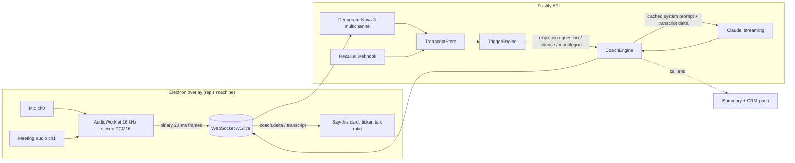

# The Closer

Real-time sales copilot. It listens to your Microsoft Teams, Zoom or Google Meet call and shows you, on a private overlay, the exact next line to say. Objection handling, discovery questions, closes and answers, generated by Claude from your playbook and the live transcript, in about one to two seconds after the prospect stops talking.

Not a note-taker. Fireflies and Gong tell you what happened after the call. The Closer tells you what to say during it.

## What is in this repo

```
the-closer/
  packages/core     Domain logic, no I/O. Transcript store, trigger engine, prompt builder,
                    streaming parser, coach engine, playbook schema. 21 unit tests.
  apps/api          Fastify + WebSocket server. Deepgram bridge, Claude coach, Recall.ai
                    webhook, Postgres schema (Drizzle), Salesforce adapter. 5 integration tests
                    that run the full pipeline over a real socket with scripted STT and model.
  apps/desktop      Electron + React overlay. Captures mic and meeting audio, streams PCM to the
                    API, renders the live script. Hidden from screen share by content protection.
  docs/             Teams integration options, go-to-market notes.
```

## Tech stack, and why

| Layer | Choice | Why this and not the alternative |
|---|---|---|
| Language | TypeScript end to end, pnpm workspaces | One language for desktop, server and shared types. The wire protocol is a shared Zod schema so the overlay and API cannot drift. |
| Audio capture | Electron 38, AudioWorklet | Electron gives system audio loopback through `setDisplayMediaRequestHandler` on Windows, plus `setContentProtection` so the overlay never appears on a screen share. Tauri would need native audio code per OS. |
| Speech to text | Deepgram Nova-3 streaming, multichannel | Sub-300 ms partials, and multichannel means rep and prospect are separate audio channels, so speaker attribution is exact rather than guessed by a diarisation model. Swap for AssemblyAI or Azure Speech behind the `SttProvider` interface. |
| Reasoning | Claude via `@anthropic-ai/sdk`, `claude-opus-5-5` at low effort, streaming, prompt caching | The playbook and call context are a stable cached system prompt; each trigger only pays for the transcript delta. Effort low keeps first-token latency in the sub-second range. `claude-sonnet-5-5` is a one-line config change if you want cheaper. Server-side refusal fallback is on so the rep never gets a blank card. |
| Meeting bot path | Recall.ai | One API for Teams, Zoom and Meet bots with real-time transcript webhooks. Building a native Teams media bot means a Windows-only .NET media SDK, an Azure Bot registration and tenant admin consent for every customer. Recall is the right call until enterprise deals force native. See `docs/TEAMS-INTEGRATION.md`. |
| API | Fastify 5, `@fastify/websocket` | Fast, typed, tiny. One WebSocket per live call: binary frames in, JSON events out. |
| Database | Postgres + Drizzle ORM | Multi-tenant schema for orgs, users, API keys, playbooks, calls, transcripts, coach events, summaries. Neon or Supabase in production. |
| CRM | Salesforce REST adapter | Logs a completed call Task with the Claude-written note against the matching Contact. HubSpot follows the same `CrmAdapter` interface. |
| Post-call | Claude structured output (Zod) | Outcome, objections and whether they were handled, commitments, next step, coaching notes, CRM note and a follow-up email draft, as one typed object. |
| Tests | Vitest | Core logic is pure and fully unit tested. The API test runs the real server and real WebSocket with a scripted STT and model, so the pipeline is proven without paying for tokens. |

## How it works



Trigger priorities decide when Claude is woken and what gets cancelled:

| Priority | Trigger | Behaviour |
|---|---|---|
| 1 | Objection keyword, prospect question, rep asks the coach | Aborts any in-flight lower-priority generation and answers now |
| 2 | Prospect finishes a substantive turn, 5 s silence after prospect | Answers unless a call was made in the last 3 s |
| 3 | Rep monologue over 75 s | Background warning with a question to hand the floor back |

Both audio channels arrive as one stereo stream so rep and prospect attribution costs nothing and is always right. Everything the model says comes out in a fixed format (`TYPE / STAGE / HEADLINE / SAY / WHY`) that the streaming parser renders word by word, so the rep sees the script before the model has finished writing the rationale.

## Run it locally

```bash
cd the-closer
cp .env.example .env            # add ANTHROPIC_API_KEY and DEEPGRAM_API_KEY
pnpm install
pnpm --filter @closer/core build
pnpm test                       # 26 tests, no network needed
pnpm dev:api                    # API on :8787
pnpm dev:desktop                # overlay window
```

Optional Postgres for persistence:

```bash
docker compose up -d postgres
pnpm --filter @closer/api db:generate && pnpm --filter @closer/api db:migrate
```

In the overlay: enter your name, the prospect, a short briefing, and press Go live. Join the Teams call as normal. The overlay stays on top and is excluded from screen capture. `Ctrl/Cmd+Shift+C` hides it, `Ctrl/Cmd+Shift+X` makes it click-through.

Without a Deepgram key the API still runs: push transcript segments over the socket (`transcript.push`) or through the Recall webhook.

## What this is not, yet

Be clear-eyed about these before selling it.

- **Claude does not "plug into" Teams.** Microsoft exposes no real-time audio or transcript API to third-party apps. There are exactly two ways to hear a call: capture the audio on the rep's machine (this repo's desktop path) or join the call as a bot participant (the Recall path). Both are how every competitor does it, including Gong and Fireflies.
- **Latency floor is about one to two seconds** from the prospect finishing a sentence to the first words of the script. Deepgram endpointing (300 ms) plus Claude first token plus the network. Reps read a suggestion while the prospect is still thinking; they do not get it mid-sentence.
- **macOS meeting audio** needs either an Electron build with ScreenCaptureKit audio loopback or a virtual audio device such as BlackHole. Windows loopback works natively. The overlay tells you which source it found.
- **Consent.** UK law lets a party to a business call record it for legitimate business purposes, but GDPR transparency still applies and several US states require all-party consent. Ship with a disclosure setting and a per-org recording policy. This is a product decision, not a code one, and it must be made before the first paying customer.
- **The keyword objection detector is a wake-up heuristic, not the classifier.** It decides priority. Claude decides what is actually happening.
- **No auth beyond a dev key, no billing, no dashboard.** The schema and the API key table are there; the Clerk or Auth0 flow, Stripe metering and the manager dashboard are the next sprint.

## Roadmap to a sellable product

1. **Week 1 to 2.** Auth (Clerk), org onboarding, playbook editor in a Next.js web app, Stripe per-seat billing. Persist calls and events to Postgres. Post-call summary emailed to the rep.
2. **Week 3 to 4.** Recall.ai bot flow end to end: paste a Teams link, bot joins, overlay shows the same card. Salesforce and HubSpot OAuth. Manager view: talk ratio, objection handling rate, suggestions used versus ignored.
3. **Month 2.** Playbook learning: which suggestions reps mark as "used" feed back into per-org prompt tuning. Team-wide objection library. SOC 2 groundwork, data retention controls, EU region.
4. **Month 3+.** Native Teams media bot for enterprise tenants that ban third-party bots. Salesforce AppExchange listing.

Pricing that fits the market: per seat per month, three tiers (individual, team with manager analytics, enterprise with CRM sync and native bot). Gong and Attention sell at over one hundred pounds per seat per month for after-the-fact analysis. A live coach that raises close rate is worth at least that.
