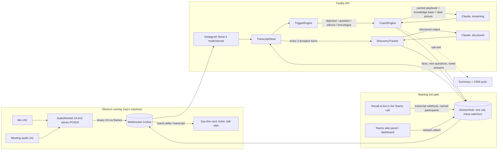

# The Closer (TheCloser.ai)

Real-time sales copilot, delivered as a website. It listens to your Microsoft Teams, Zoom or Google Meet call and shows you, on a private overlay, the exact next line to say. Objection handling, discovery questions, closes and answers, generated by Claude from your playbook and the live transcript, in about one to two seconds after the prospect stops talking.

Not a note-taker. Fireflies and Gong tell you what happened after the call. The Closer tells you what to say during it, answers the questions the prospect asks from your own material, and keeps track of which qualifying questions you still need to ask.

How a rep uses it: sign in at TheCloser.ai, paste the meeting link, a participant joins the call under a name you choose, and the call page opens. Left: the live transcript. Right: the next line to say, the deal picture, and a chat with Claude that has read every word. When the call ends, the summary, follow-up email and CRM note are one click away. Calls you already recorded in Fireflies import and get the same treatment.

Two ways to hear the call, one pipeline:

- **Listen on the rep's machine.** The Electron overlay captures mic and meeting audio. Nothing joins the call.
- **Send a bot into the meeting.** Paste a Teams, Zoom or Meet link. A notetaker bot joins, transcribes every participant by name, and the rep watches the live script in the overlay, in a Teams meeting side panel, or from any dashboard attached to the call.

## What is in this repo

```
the-closer/
  packages/core     Domain logic, no I/O. Transcript store, trigger engine, prompt builder,
                    streaming parser, coach engine, playbook schema. 21 unit tests.
  apps/api          Fastify + WebSocket server. Deepgram bridge, Claude coach, Recall.ai
                    webhook, Postgres schema (Drizzle), Salesforce adapter. 5 integration tests
                    that run the full pipeline over a real socket with scripted STT and model.
  apps/desktop      Electron + React overlay. Captures mic and meeting audio, or sends a bot in and
                    attaches. Renders the live script, the deal picture and the next questions.
                    Hidden from screen share by content protection.
  apps/web          The website. Next.js 15: landing page, sign up and sign in, dashboard, live call
                    page with transcript, coach card, deal picture and Claude chat, Fireflies import,
                    knowledge base editor.
  apps/teams-panel  Static Teams meeting side panel (Teams JS SDK) with a manifest. Same protocol,
                    runs inside the Teams meeting window.
  docs/             Teams integration options, go-to-market notes.
```

## Tech stack, and why

| Layer | Choice | Why this and not the alternative |
|---|---|---|
| Language | TypeScript end to end, pnpm workspaces | One language for desktop, server and shared types. The wire protocol is a shared Zod schema so the overlay and API cannot drift. |
| Audio capture | Electron 38, AudioWorklet | Electron gives system audio loopback through `setDisplayMediaRequestHandler` on Windows, plus `setContentProtection` so the overlay never appears on a screen share. Tauri would need native audio code per OS. |
| Speech to text | Deepgram Nova-3 streaming, multichannel | Sub-300 ms partials, and multichannel means rep and prospect are separate audio channels, so speaker attribution is exact rather than guessed by a diarisation model. Swap for AssemblyAI or Azure Speech behind the `SttProvider` interface. |
| Reasoning | Claude via `@anthropic-ai/sdk`, `claude-opus-5-5` at low effort, streaming, prompt caching | The playbook and call context are a stable cached system prompt; each trigger only pays for the transcript delta. Effort low keeps first-token latency in the sub-second range. `claude-sonnet-5-5` is a one-line config change if you want cheaper. Server-side refusal fallback is on so the rep never gets a blank card. |
| Meeting bot path | Recall.ai | One API for Teams, Zoom and Meet bots with real-time transcript webhooks. Building a native Teams media bot means a Windows-only .NET media SDK, an Azure Bot registration and tenant admin consent for every customer. Recall is the right call until enterprise deals force native. See `docs/TEAMS-INTEGRATION.md`. |
| API | Fastify 5, `@fastify/websocket` | Fast, typed, tiny. One WebSocket per live call: binary frames in, JSON events out. |
| Database | Postgres + Drizzle ORM | Multi-tenant schema for orgs, users, API keys, playbooks, calls, transcripts, coach events, summaries. Neon or Supabase in production. |
| CRM | Salesforce REST adapter | Logs a completed call Task with the Claude-written note against the matching Contact. HubSpot follows the same `CrmAdapter` interface. |
| Post-call | Claude structured output (Zod) | Outcome, objections and whether they were handled, commitments, next step, coaching notes, CRM note and a follow-up email draft, as one typed object. |
| Web | Next.js 15, React 19, plain CSS | App router, client components for the live page. No UI framework so the bundle stays small and the design stays yours. Deploys to Vercel in one command. |
| Accounts | Email and password, scrypt hashes, HS256 JWT in an HttpOnly cookie | Enough to launch. The `UserStore` interface swaps to Postgres or Clerk without touching the routes. The JWT also works as a Bearer token for the desktop app. |
| Fireflies | GraphQL client | Brings in transcripts a customer already has so day one is not empty. |
| Tests | Vitest | Core logic is pure and fully unit tested. The API test runs the real server and real WebSocket with a scripted STT and model, so the pipeline is proven without paying for tokens. |

## How it works



Trigger priorities decide when Claude is woken and what gets cancelled:

| Priority | Trigger | Behaviour |
|---|---|---|
| 1 | Objection keyword, prospect question, rep asks the coach | Aborts any in-flight lower-priority generation and answers now |
| 2 | Prospect finishes a substantive turn, 5 s silence after prospect | Answers unless a call was made in the last 3 s |
| 3 | Rep monologue over 75 s | Background warning with a question to hand the floor back |

Both audio channels arrive as one stereo stream so rep and prospect attribution costs nothing and is always right. On the bot path, participants arrive named, so the rep is matched by display name and everyone else is the prospect side. Everything the model says comes out in a fixed format (`TYPE / STAGE / HEADLINE / SAY / WHY`) that the streaming parser renders word by word, so the rep sees the script before the model has finished writing the rationale.

### Auto-join from your calendar

Connect Microsoft 365 or Google Calendar once under Auto-join. The scheduler reads the next twenty minutes of your calendar every five minutes and books a bot for every meeting with a join link and an external attendee, timed to arrive a minute early. The settings page shows what will be joined and why not for everything else. Step by step in `docs/BACKEND-STATUS.md`.

### Working the call with Claude

`POST /v1/calls/:id/chat` is the same thing as pasting a Fireflies transcript into Claude and asking for help, except the transcript is already there and live. Every turn the server supplies the current transcript, the playbook, the knowledge base and the latest deal picture as context, then streams Claude's reply. It works during the call ("what is the real objection here?", "draft the close") and after it ("score this call", "write the follow-up"). The browser keeps the thread; the server never stores chat.

### Answering the prospect and asking the right questions

- **Knowledge base.** `PUT /v1/knowledge/:id` with plain text: price list, capability statement, FAQs, case studies, compliance answers. The whole pack goes into the cached system prompt in a deterministic order, so it is paid for once per call and every answer can quote it. When the prospect asks a question the coach answers it from the pack in the rep's voice, then adds the question that moves the call on. If the answer is not there, it gives an honest holding line rather than a guess.
- **Web search, optional.** `COACH_WEB_SEARCH=true` gives the coach Claude's web search tool for questions outside the playbook (a regulation, a competitor claim, a news item). It costs seconds when used, so leave it off for pure product calls.
- **Discovery tracker.** Every three prospect turns a structured Claude call reads the transcript and returns the deal picture: facts learned with evidence and confidence (budget, timeline, authority, pain, competitor), which discovery questions are answered, the three to five highest-value questions still open, prospect questions the rep still owes an answer to, risks and buying signals. The next coach card sees this, so "say this" in a quiet moment becomes the best unanswered question rather than filler. The overlay and side panel show it as "Ask next" and "You still owe them".

## Run it locally

```bash
cd the-closer
cp .env.example .env            # add ANTHROPIC_API_KEY; RECALL_API_KEY for the bot; DEEPGRAM_API_KEY only for desktop audio
pnpm install
pnpm --filter @closer/core build
pnpm test                       # 62 tests; Postgres and Redis suites run when TEST_DATABASE_URL / TEST_REDIS_URL are set
pnpm dev:api                    # API on :8787
pnpm --filter @closer/web dev   # website on :3000
pnpm dev:desktop                # optional: overlay window
```

Open http://localhost:3000, create an account, add your price list under Knowledge, then Start a call. The API works without any vendor keys for accounts, knowledge, Fireflies import and call history; the coach, chat and summary need an Anthropic key, and the bot needs Recall.

### Deploy

- **Web**: `apps/web` to Vercel. Set `NEXT_PUBLIC_API_URL=https://api.thecloser.ai`.
- **API**: `apps/api` to Fly.io, Railway or Render (it needs long-lived WebSockets and server-sent events, so not a serverless function). Set `PUBLIC_URL=https://api.thecloser.ai`, `SECURE_COOKIES=true`, a real `JWT_SECRET`, and the vendor keys. Point Recall's webhook at `PUBLIC_URL/v1/webhooks/recall`.
- **Data**: the in-memory `UserStore` and `CallStore` are for development. Implement both interfaces on the Drizzle schema in `apps/api/src/db/schema.ts` before real customers, or every restart forgets them.

Optional Postgres for persistence:

```bash
docker compose up -d postgres
pnpm --filter @closer/api db:generate && pnpm --filter @closer/api db:migrate
```

In the overlay: enter your name, the prospect, a short briefing, and press Go live. Join the Teams call as normal. The overlay stays on top and is excluded from screen capture. `Ctrl/Cmd+Shift+C` hides it, `Ctrl/Cmd+Shift+X` makes it click-through.

### Bot mode

```bash
# 1. Recall.ai account: set RECALL_API_KEY and RECALL_REGION in .env
# 2. The API must be reachable from the internet for webhooks. Locally:
cloudflared tunnel --url http://localhost:8787        # or ngrok http 8787
# 3. Put the tunnel URL in .env as PUBLIC_URL, restart the API
pnpm dev:api
```

Then either:

- Overlay: choose "Send a bot into the meeting", paste the join link, Go live.
- Teams side panel: `pnpm --filter @closer/teams-panel dev`, open it, paste the link, "Send the bot in". Install into Teams following `apps/teams-panel/README.md`.
- API: `POST /v1/bots {meetingUrl, context}` returns a `callId`; attach with `{type: "session.attach", callId}` on the socket or read `GET /v1/calls/:id/events` as server-sent events.

Load the coach's material first:

```bash
curl -X PUT localhost:8787/v1/knowledge/pricing -H "Authorization: Bearer dev-local-key" -H "Content-Type: application/json" \
  -d '{"title":"Price list","body":"Bid review from £1,500. Full bid management from £6,000. Fixed fee, 50% on instruction, 50% on submission.","tags":["pricing"]}'
```

Without a Deepgram key the API still runs: the bot path needs no Deepgram key at all, and you can push transcript segments over the socket (`transcript.push`) for testing.

## What this is not, yet

Be clear-eyed about these before selling it.

- **Claude does not "plug into" Teams.** Microsoft exposes no real-time audio or transcript API to third-party apps. There are exactly two ways to hear a call: capture the audio on the rep's machine (this repo's desktop path) or join the call as a bot participant (the Recall path). Both are how every competitor does it, including Gong and Fireflies.
- **Latency floor is about one to two seconds** from the prospect finishing a sentence to the first words of the script. Deepgram endpointing (300 ms) plus Claude first token plus the network. Reps read a suggestion while the prospect is still thinking; they do not get it mid-sentence.
- **macOS meeting audio** needs either an Electron build with ScreenCaptureKit audio loopback or a virtual audio device such as BlackHole. Windows loopback works natively. The overlay tells you which source it found.
- **Consent.** UK law lets a party to a business call record it for legitimate business purposes, but GDPR transparency still applies and several US states require all-party consent. Ship with a disclosure setting and a per-org recording policy. This is a product decision, not a code one, and it must be made before the first paying customer.
- **The bot is a visible participant.** It joins under whatever display name you set per call; the default is your name plus "(notes)". You can name it like a colleague. Before you do: UK GDPR still requires you to be transparent that the call is being recorded and processed, and a prospect who later works out that the "colleague" was software will not trust the rest of what you told them. The safe pattern is a named notetaker plus a one-line disclosure at the top of the call, which is what every incumbent does. Tenants that block third-party bots need the local-capture mode or a native Teams bot (see `docs/TEAMS-INTEGRATION.md`).
- **The bot path needs a public HTTPS URL** for Recall's webhooks, so local development uses a tunnel.
- **Answers are only as good as the knowledge base.** Load the price list, capability statement and FAQs before the first call. The coach is told never to invent a number, and the fix for a wrong holding line is a better document, not a prompt tweak.
- **The keyword objection detector is a wake-up heuristic, not the classifier.** It decides priority. Claude decides what is actually happening.
- **Not built: SSO sign-in and usage-based billing.** Accounts are email and password with verification, reset, invitations and roles; plans are flat per seat through Stripe. The rest of the platform list (CRM sync, quotas, encryption at rest, retention, export and delete, metrics, multi-instance) is in and tested; see `docs/BACKEND-STATUS.md`.

## Roadmap to a sellable product

1. **Week 1 to 2.** Auth (Clerk), org onboarding, playbook editor in a Next.js web app, Stripe per-seat billing. Persist calls and events to Postgres. Post-call summary emailed to the rep.
2. **Week 3 to 4.** Recall.ai bot flow end to end: paste a Teams link, bot joins, overlay shows the same card. Salesforce and HubSpot OAuth. Manager view: talk ratio, objection handling rate, suggestions used versus ignored.
3. **Month 2.** Playbook learning: which suggestions reps mark as "used" feed back into per-org prompt tuning. Team-wide objection library. SOC 2 groundwork, data retention controls, EU region.
4. **Month 3+.** Native Teams media bot for enterprise tenants that ban third-party bots. Salesforce AppExchange listing.

Pricing that fits the market: per seat per month, three tiers (individual, team with manager analytics, enterprise with CRM sync and native bot). Gong and Attention sell at over one hundred pounds per seat per month for after-the-fact analysis. A live coach that raises close rate is worth at least that.
